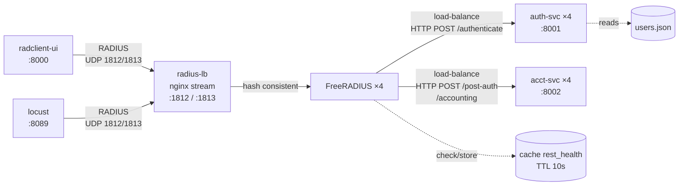
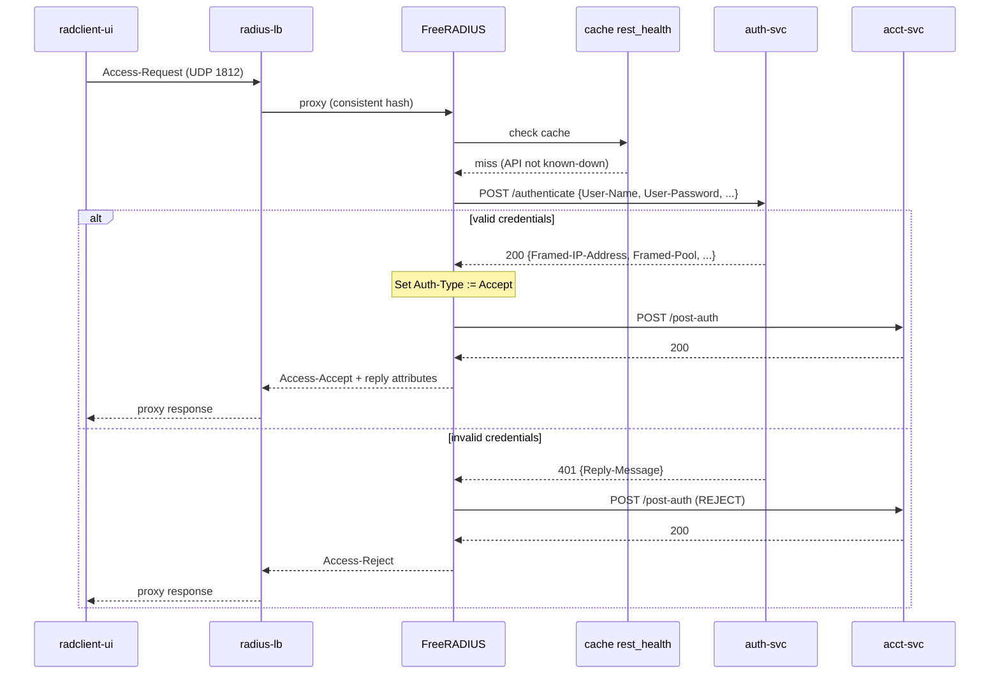
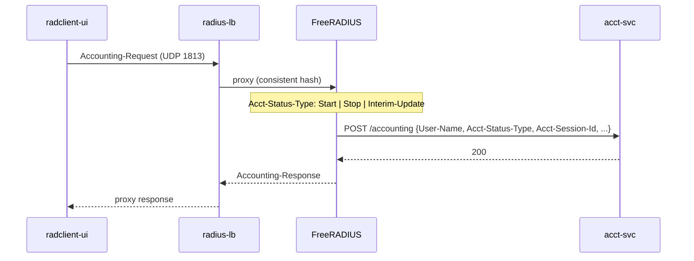
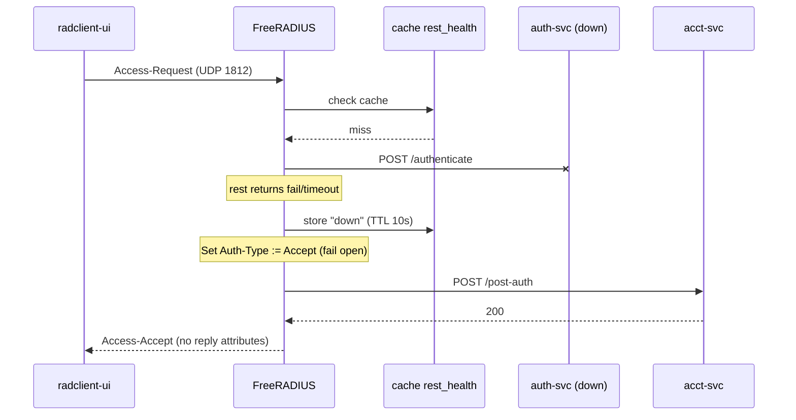
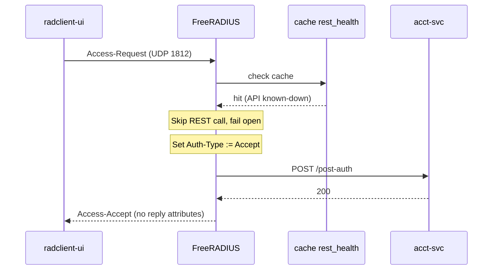
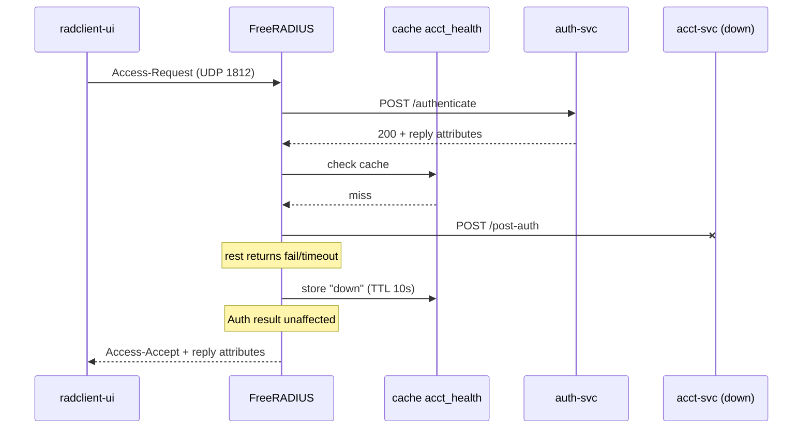
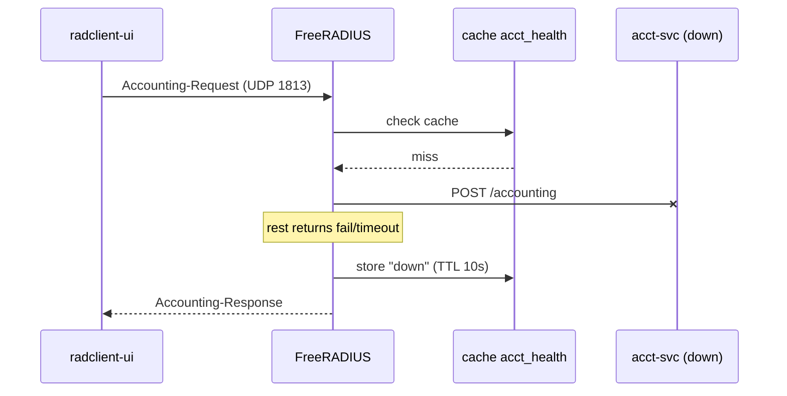
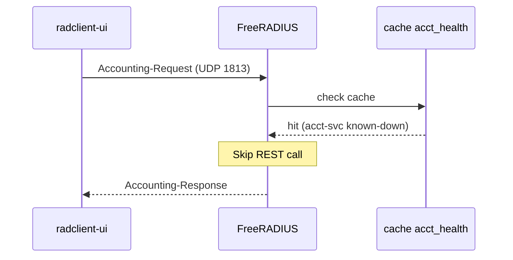

# freeradius-http-auth

FreeRADIUS 3.x test environment using `rlm_rest` to delegate authentication and accounting to HTTP microservices. Intended for development and testing of RADIUS logic without a real BNG. Comes with basic ui for generating radius packets for testing


## Architecture



| Container | Role | Instances | Port |
|---|---|---|---|
| `radius-lb` | nginx UDP load balancer, distributes RADIUS to FreeRADIUS instances via consistent hash | 1 | 1812/udp, 1813/udp |
| `freeradius-{1..4}` | RADIUS server, delegates auth/acct to HTTP backends via `rlm_rest` with `load-balance` | 4 | 1812/udp, 1813/udp |
| `auth-svc-{1..4}` | Authenticates against a JSON user file (PAP, CHAP), returns reply attributes | 4 | 8001 |
| `acct-svc-{1..4}` | Logs post-auth and accounting events | 4 | 8002 |
| `locust-master` | Load test orchestrator | 1 | 8089 |
| `locust-worker` | Load test workers sending RADIUS packets via pyrad | 10 | - |
| `radclient-ui` | Web UI for manual RADIUS testing | 1 | 8000 |

### Request flow

```
AUTH (70% of load test traffic):
  locust ──UDP──▶ radius-lb ──UDP──▶ freeradius-N
    freeradius-N ──HTTP POST /authenticate──▶ auth-svc-{random 1-4}
    freeradius-N ──HTTP POST /post-auth─────▶ acct-svc-{random 1-4}
  freeradius-N ──UDP──▶ radius-lb ──UDP──▶ locust

ACCT (30% of load test traffic):
  locust ──UDP──▶ radius-lb ──UDP──▶ freeradius-N
    freeradius-N ──HTTP POST /accounting────▶ acct-svc-{random 1-4}
  freeradius-N ──UDP──▶ radius-lb ──UDP──▶ locust
```

FreeRADIUS connects directly to the backend services (no HTTP reverse proxy). Each FreeRADIUS instance uses `load-balance` blocks with 4 `rlm_rest` module instances (one per backend) to distribute HTTP calls evenly.

## Authentication flow



## Accounting flow



## Failover

### auth-svc unavailable (first request)



### auth-svc unavailable (cached, within 10s)



### acct-svc unavailable (first request)

Post-auth and accounting both target acct-svc. If it is unreachable, the failure is cached for 10s (`rlm_cache` instance `acct_health`). Authentication results are unaffected.





### acct-svc unavailable (cached, within 10s)



## Quick start

```
docker compose up --build
```

Open `http://localhost:8000`.

Default test user: `subscriber1` / `secret123`.

## Load testing

Open `http://localhost:8089` for the Locust web UI. The test uses 10 worker processes sending real RADIUS packets via pyrad.

Task mix (weighted):
- `Access-Request` valid credentials (10), bad password (3), unknown user (1)
- `Accounting-Request` Start (3), Interim-Update (2), Stop (1)

## Configuration

RADIUS shared secret defaults to `testing123`. Override with:

```
RADIUS_SECRET=mysecret docker compose up
```

### FreeRADIUS

Volume-mounted config files:

- `freeradius/radiusd.conf` -- server config, thread pool tuning
- `freeradius/clients.conf` -- client definitions and shared secret
- `freeradius/mods-enabled/rest` -- `rlm_rest` module instances (`rest_auth1..4`, `rest_acct1..4`), direct HTTP connections to backends with per-instance connection pools (3s timeout)
- `freeradius/mods-enabled/cache_rest_health` -- `rlm_cache` instance, caches auth-svc/acct-svc failures for 10s
- `freeradius/sites-enabled/default` -- virtual server, uses `load-balance` blocks to distribute HTTP calls across backend instances

### auth-svc

User database at `auth-svc/data/users.json`. Each entry has a password and a set of RADIUS reply attributes:

```json
{
  "subscriber1": {
    "password": "secret123",
    "attributes": {
      "Framed-IP-Address": "10.0.0.2",
      "Framed-Pool": "POOL_RESIDENTIAL",
      "Mikrotik-Rate-Limit": "50M/50M"
    }
  }
}
```

CHAP is supported. The service validates CHAP-Password against CHAP-Challenge using the stored password.

### Failover

If `auth-svc` is unreachable, FreeRADIUS fails open (accepts all). The failure is cached for 10 seconds (`rlm_cache` instance `rest_health`), so subsequent requests during that window skip the REST call entirely instead of waiting for a timeout. The same pattern applies to `acct-svc` via the `acct_health` cache instance. After the TTL expires the next request retries the API. Both cases are handled in `sites-enabled/default`.

## File structure

```
freeradius-http-auth/
  docker-compose.yml
  freeradius/
    radiusd.conf
    clients.conf
    mods-enabled/rest
    mods-enabled/cache_rest_health
    sites-enabled/default
  nginx/
    radius-lb.conf
  auth-svc/
    Dockerfile
    requirements.txt
    app/main.py
    app/models.py
    data/users.json
  acct-svc/
    Dockerfile
    requirements.txt
    app/main.py
    app/models.py
  loadtest/
    Dockerfile
    requirements.txt
    locustfile.py
    dictionary
  radclient-ui/
    Dockerfile
    requirements.txt
    app/main.py
    app/static/logo-w.png
    app/templates/index.html
```

## Development

FreeRADIUS config changes require a container restart:

```
docker compose restart freeradius-1 freeradius-2 freeradius-3 freeradius-4
```

Python service code is volume-mounted. Restart the services to pick up changes:

```
docker compose restart auth-svc-1 auth-svc-2 auth-svc-3 auth-svc-4
```
