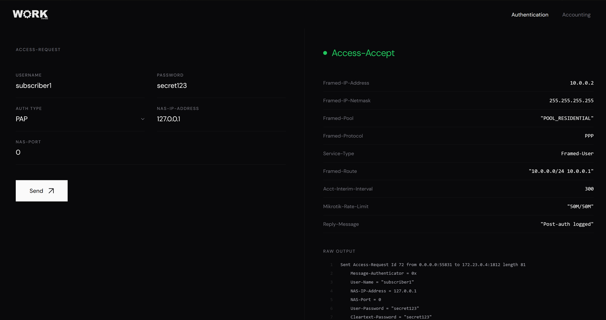
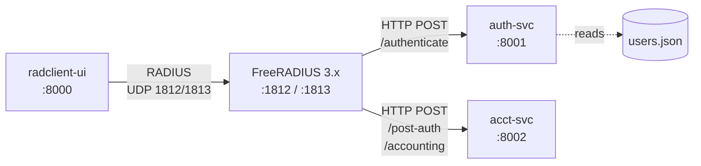
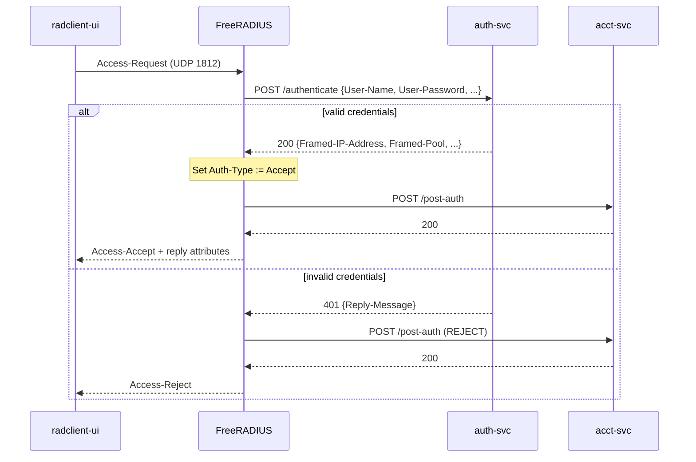
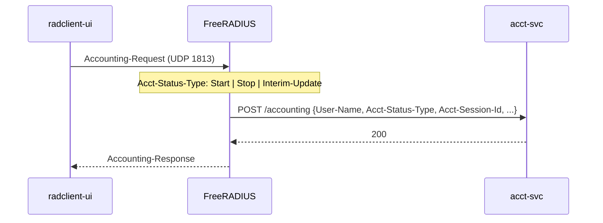
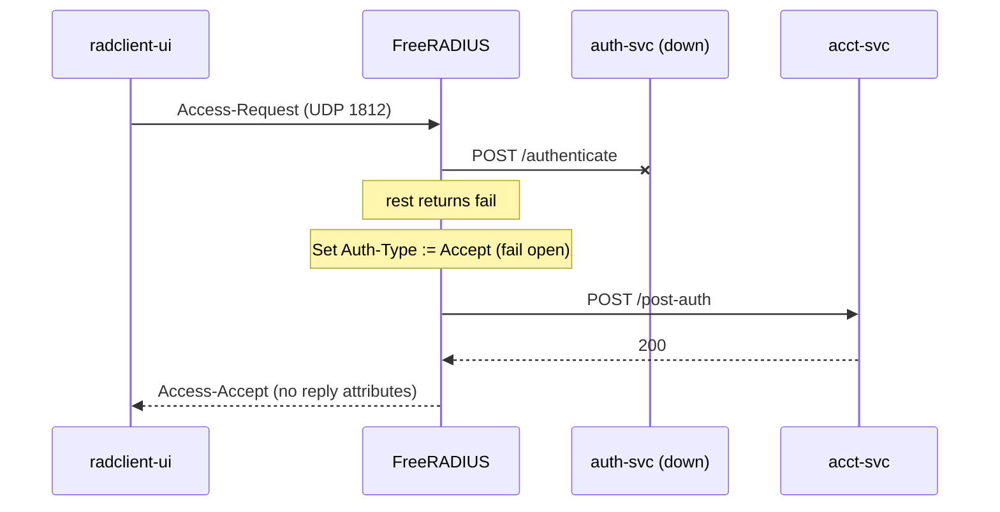
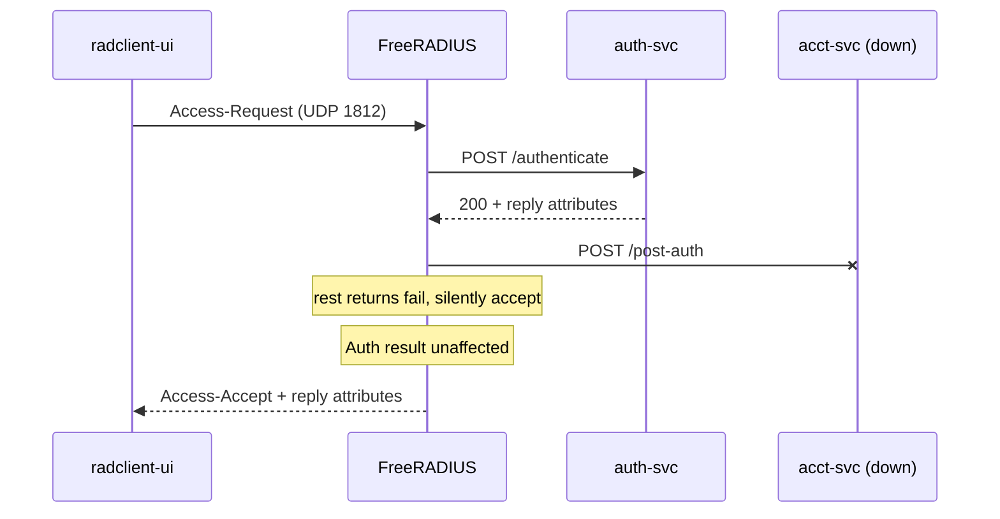
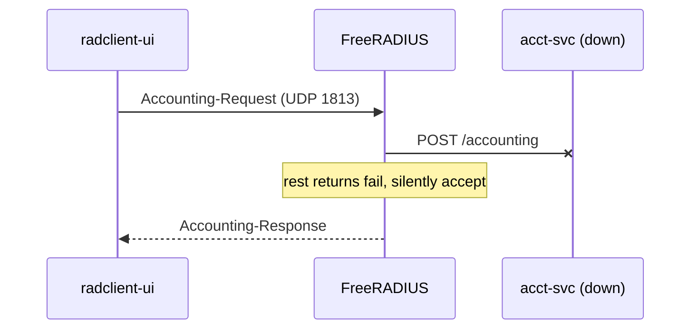

# freeradius-http-auth

FreeRADIUS 3.x test environment using `rlm_rest` to delegate authentication and accounting to HTTP microservices. Intended for development and testing of RADIUS logic without a real BNG. Comes with basic ui for generating radius packets for testing



## Architecture



| Container | Role | Port |
|---|---|---|
| `freeradius` | RADIUS server, proxies auth/acct to HTTP backends via `rlm_rest` | 1812/udp, 1813/udp |
| `auth-svc` | Authenticates against a JSON user file (PAP, CHAP), returns reply attributes | 8001 |
| `acct-svc` | Logs post-auth and accounting events to stdout | 8002 |
| `radclient-ui` | Web UI that shells out to `radclient` | 8000 |

## Authentication flow



## Accounting flow



## Failover

### auth-svc unavailable



### acct-svc unavailable

Post-auth and accounting both target acct-svc. If it is unreachable, both silently succeed and FreeRADIUS logs the request to stdout (running with `-X`). Authentication results are unaffected.





## Quick start

```
docker compose up --build
```

Open `http://localhost:8000`.

Default test user: `subscriber1` / `secret123`.

## Configuration

RADIUS shared secret defaults to `testing123`. Override with:

```
RADIUS_SECRET=mysecret docker compose up
```

### FreeRADIUS

Volume-mounted config files:

- `freeradius/radiusd.conf` -- server config, thread pool tuning
- `freeradius/clients.conf` -- client definitions and shared secret
- `freeradius/mods-enabled/rest` -- `rlm_rest` module, HTTP endpoints for auth/acct
- `freeradius/sites-enabled/default` -- virtual server, processing sections

### auth-svc

User database at `auth-svc/data/users.json`. Each entry has a password and a set of RADIUS reply attributes:

```json
{
  "subscriber1": {
    "password": "secret123",
    "attributes": {
      "Framed-IP-Address": "10.0.0.2",
      "Framed-Pool": "POOL_RESIDENTIAL",
      "Mikrotik-Rate-Limit": "50M/50M"
    }
  }
}
```

CHAP is supported. The service validates CHAP-Password against CHAP-Challenge using the stored password.

### Failover

If `auth-svc` is unreachable, FreeRADIUS fails open (accepts all). If `acct-svc` is unreachable, accounting silently succeeds. Both cases are handled in `sites-enabled/default`.

## File structure

```
freeradius-http-auth/
  docker-compose.yml
  freeradius/
    radiusd.conf
    clients.conf
    mods-enabled/rest
    sites-enabled/default
  auth-svc/
    Dockerfile
    requirements.txt
    app/main.py
    app/models.py
    data/users.json
  acct-svc/
    Dockerfile
    requirements.txt
    app/main.py
    app/models.py
  radclient-ui/
    Dockerfile
    requirements.txt
    app/main.py
    app/static/logo-w.png
    app/templates/index.html
```

## Development

All Python services run with `--reload`. Source files are volume-mounted, so code changes take effect without rebuilding.

FreeRADIUS config changes require a container restart:

```
docker compose restart freeradius
```
