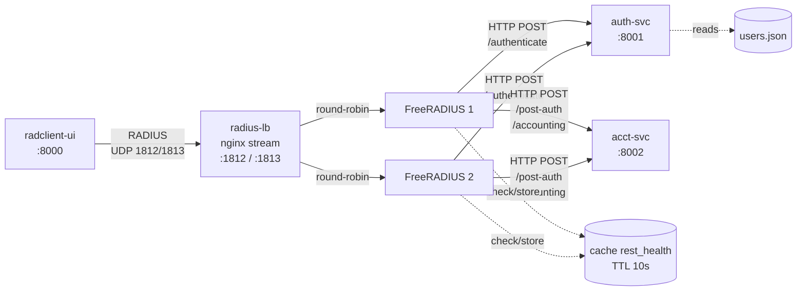

# freeradius-http-auth

FreeRADIUS 3.x test environment using `rlm_rest` to delegate authentication and accounting to HTTP microservices. Includes a web UI for manual RADIUS testing and performance testing with radperf.


## Architecture



| Container | Role | Port |
|---|---|---|
| `radius-lb` | nginx UDP load balancer, round-robin across FreeRADIUS instances | 1812/udp, 1813/udp |
| `freeradius-1`, `freeradius-2` | RADIUS server, delegates auth/acct to HTTP backends via `rlm_rest` | — |
| `auth-svc` | Validates credentials against `users.json` (PAP and CHAP) | 8001 |
| `acct-svc` | Accepts post-auth and accounting events | 8002 |
| `radclient-ui` | Web UI for manual RADIUS testing and radperf load testing | 8000 |

### Request flow

```
AUTH:
  client ──UDP──▶ radius-lb ──UDP──▶ freeradius-N
    freeradius-N ──HTTP POST /authenticate──▶ auth-svc
    freeradius-N ──HTTP POST /post-auth─────▶ acct-svc
  freeradius-N ◀──UDP── radius-lb ◀──UDP── client

ACCT:
  client ──UDP──▶ radius-lb ──UDP──▶ freeradius-N
    freeradius-N ──HTTP POST /accounting────▶ acct-svc
  freeradius-N ◀──UDP── radius-lb ◀──UDP── client
```

## Quick start

```
docker compose up --build
```

Open http://localhost:8000. Default test user: `subscriber1` / `secret123`.

## Load testing

The radclient-ui includes a load test tab powered by [radperf](https://networkradius.com/radius-performance-testing/), a native C RADIUS performance testing tool from NetworkRADIUS.

Configure concurrency and duration, then click Start. radperf sends traffic directly to the configured target hosts using parallel outstanding requests.

## Failover

FreeRADIUS uses `rlm_cache` to track backend availability:

- **auth-svc down**: First request times out, caches failure for 10s. Subsequent requests skip the REST call and fail open (accept all). After TTL expires, the next request retries.
- **acct-svc down**: Same pattern. Post-auth and accounting failures are cached independently. Authentication results are unaffected.

Both cases are handled in `sites-enabled/default`.

## Configuration

RADIUS shared secret defaults to `testing123`. Override with:

```
RADIUS_SECRET=mysecret docker compose up
```

### FreeRADIUS

Volume-mounted config files:

- `freeradius/radiusd.conf` — server config, thread pool tuning
- `freeradius/clients.conf` — client definitions and shared secret
- `freeradius/mods-enabled/rest` — `rlm_rest` module instances for auth-svc and acct-svc with connection pool settings
- `freeradius/mods-enabled/cache_rest_health` — `rlm_cache` instances for backend failure tracking (10s TTL)
- `freeradius/sites-enabled/default` — virtual server with authorize, post-auth, and accounting sections

### auth-svc

User database at `auth-svc/data/users.json`:

```json
{
  "subscriber1": {
    "password": "secret123",
    "attributes": {
      "Framed-IP-Address": "10.0.0.2",
      "Framed-Pool": "POOL_RESIDENTIAL",
      "Mikrotik-Rate-Limit": "50M/50M"
    }
  }
}
```

CHAP is supported. The service validates CHAP-Password against CHAP-Challenge using the stored password.

## File structure

```
freeradius-http-auth/
  docker-compose.yml
  freeradius/
    radiusd.conf
    clients.conf
    mods-enabled/rest
    mods-enabled/cache_rest_health
    sites-enabled/default
  nginx/
    radius-lb.conf
  auth-svc/
    Dockerfile
    requirements.txt
    app/main.py
    data/users.json
  acct-svc/
    Dockerfile
    requirements.txt
    app/main.py
  radclient-ui/
    Dockerfile
    requirements.txt
    app/main.py
    app/templates/index.html
    app/static/logo-w.png
```

## Development

FreeRADIUS config changes require a container restart:

```
docker compose restart freeradius-1 freeradius-2
```

Python service code is volume-mounted with hot reload enabled for radclient-ui. auth-svc and acct-svc require a restart:

```
docker compose restart auth-svc acct-svc
```
